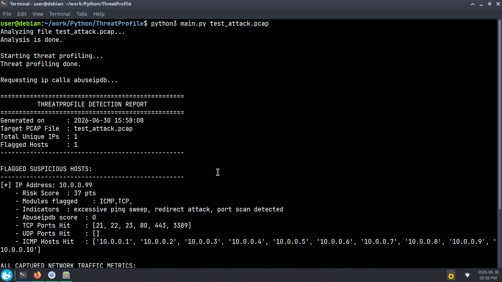
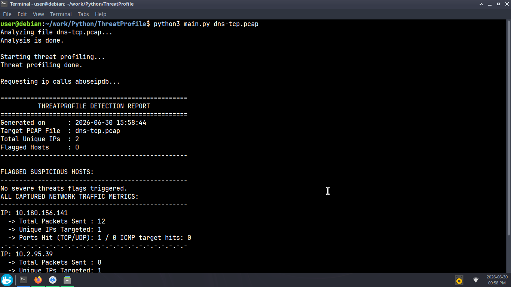

# ThreatProfile

A command-line Python tool that analyzes `.pcap` files and flags suspicious network behavior. Built entirely with Scapy.

---

## What is ThreatProfile?

ThreatProfile is a blue team forensics tool for SOC analysts who need to quickly profile network captures for suspicious activity. It parses raw `.pcap` files, scores each IP's behavior across four protocols using thresholds you configure yourself, enriches flagged IPs with AbuseIPDB threat intelligence, and generates a structured report — printed to terminal and saved as a `.txt` file for later reference.

---

## Features

- **Asset-centric data model** — every IP gets its own profile built up across all protocols instead of separate per-protocol lists. Made way more sense once I thought about how I'd actually use the data later.
- **ICMP analysis** — detects ping sweeps, ICMP redirects (a man-in-the-middle signal), and destination unreachable floods
- **TCP analysis** — detects port scanning via SYN flag tracking. Dynamic and ephemeral ports get filtered out before scoring — they open and close for one conversation and aren't a real scanning signal, just noise.
- **UDP analysis** — same volume-based port scanning detection as TCP, same dynamic port filtering
- **DNS tunneling detection** — flags DNS queries ≥200 bytes as possible data exfiltration. DNS is almost never blocked by firewalls, which makes it a popular smuggling channel.
- **Configurable scoring** — thresholds, multipliers, and flagging thresholds all live in `config.json`.
- **Per-protocol independent flagging** — ICMP, TCP, UDP, and DNS each carry their own verdict.
- **AbuseIPDB enrichment** — flagged IPs get automatically checked against AbuseIPDB for community threat intel
- **Structured report** — summary header, flagged host details with risk scores and indicators, full traffic metrics for every IP seen. Printed to terminal and saved to `.txt`.

---

## Project Structure

```
ThreatProfile/
├── main.py          # Entry point — wires the full pipeline together, handles CLI args
├── analyzer.py      # Data gathering — parses packets and builds per-IP profiles
├── assess.py        # Judgment logic — scores behavior and flags suspicious IPs
├── report.py        # Report generation — formats and outputs findings
├── config.json      # User-configurable thresholds and scoring multipliers
├── requirements.txt # Python dependencies
└── README.md
```

---

## Getting Started

**Requirements:**
- Python 3.12+
- Scapy
- Requests

**Installation:**
```bash
git clone https://github.com/fraqve/ThreatProfile.git
cd ThreatProfile
pip install -r requirements.txt
```

**Configure your API key:**

Open `config.json` and replace the placeholder with your AbuseIPDB API key:
```json
{
    "abuseipdb_api_key": "YOUR_API_KEY_HERE",
    ...
}
```

Get a free key at [abuseipdb.com](https://www.abuseipdb.com). If the key is missing or invalid, the tool will flag it in the report and keep going — the rest of the pipeline works fine without it.

**Run:**
```bash
python3 main.py your_capture.pcap
```

The report prints to terminal and saves as `report_your_capture.txt` in the same directory.

---

## Known Limitations

**No stateful tracking.** A real SYN scan detection means checking whether SYNs ever got SYN-ACKs back, which means tracking conversations across packets over time. v1 detects scans by volume instead — if an IP hits enough unique well-known ports, that's the signal. Stateful tracking is a v2 target.

**No time-based analysis.** Everything is volume-based. A slow, low-and-slow scan spread across hours looks like normal background traffic to this tool. Time-window detection is a v2 target.

**Basic DNS tunneling detection.** I only catch single queries that are abnormally long on their own. An attacker splitting data across many smaller queries stays under the threshold. Catching that requires stateful frequency tracking — same problem as above.

**Fragmented packets aren't handled.** Scapy loses protocol headers on some fragmented packets, making attribution impossible without stream reassembly. Scoped out for v1.

## Demo

**Attack traffic detected:**


*ThreatProfile flagging a host conducting an ICMP ping sweep, redirect attack, and TCP port scan — 37 risk points across two protocols.*

**Clean traffic — no flags triggered:**


*Normal DNS and TCP traffic passing through with zero flags — confirming the tool doesn't generate false positives on legitimate traffic.*
